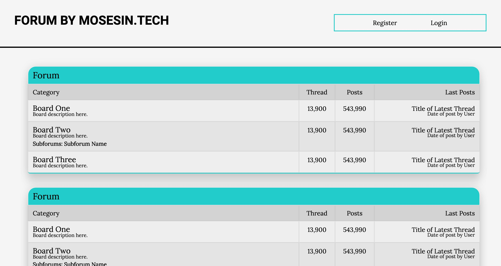
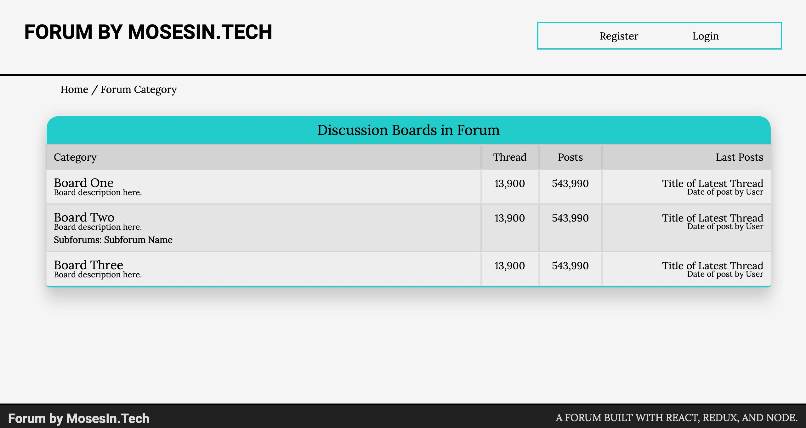
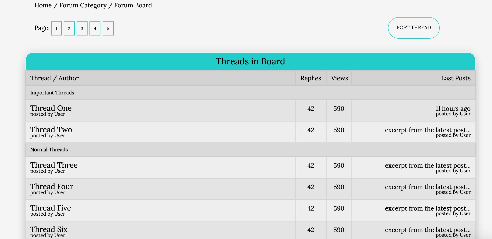
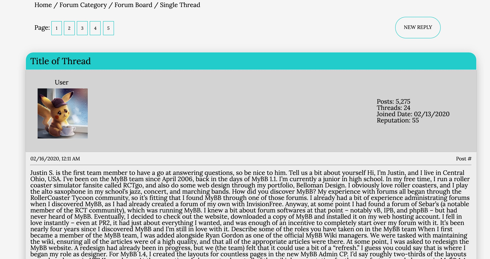
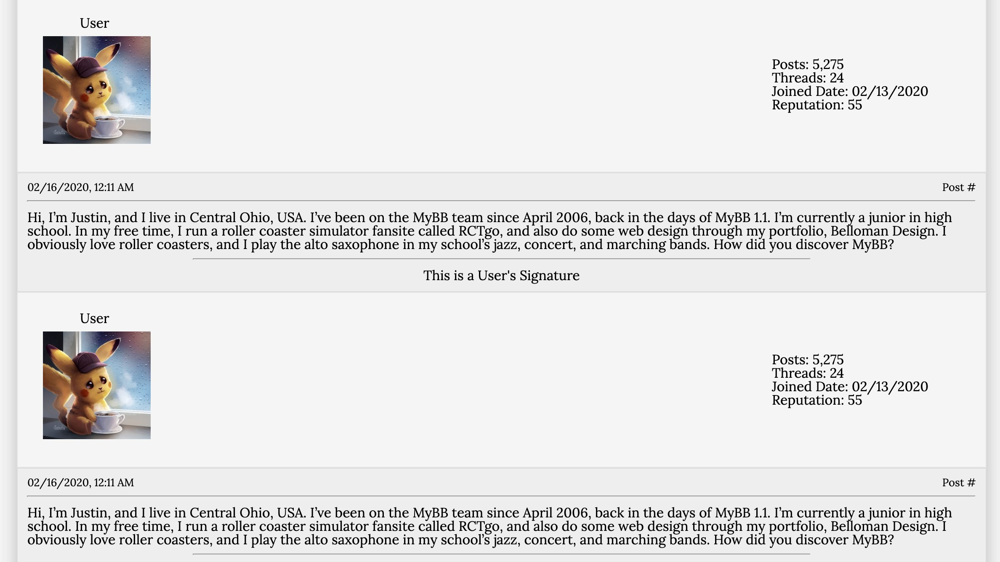
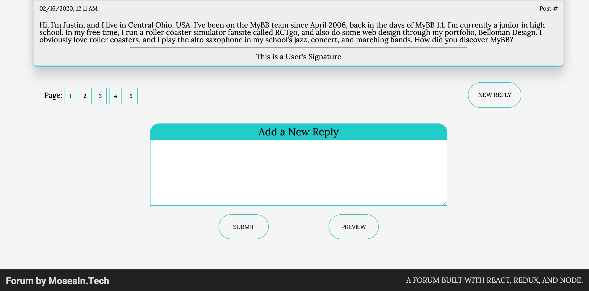
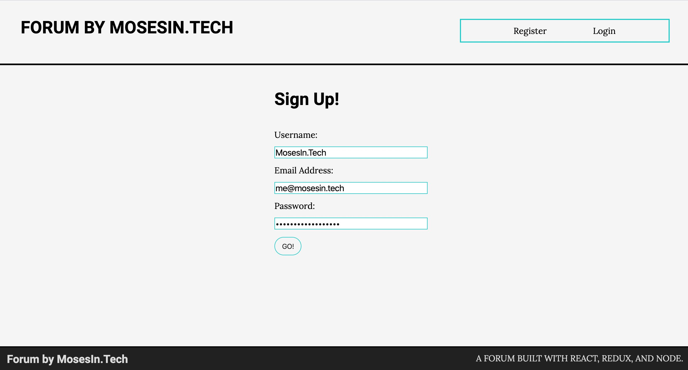
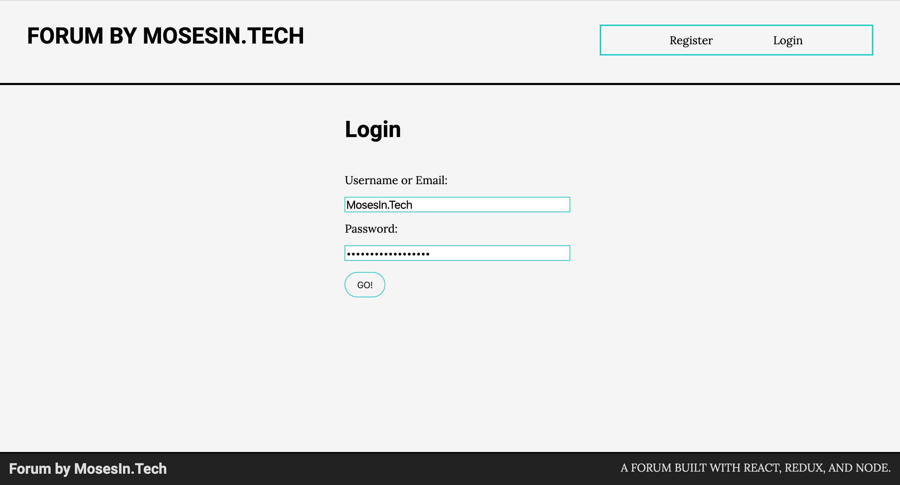
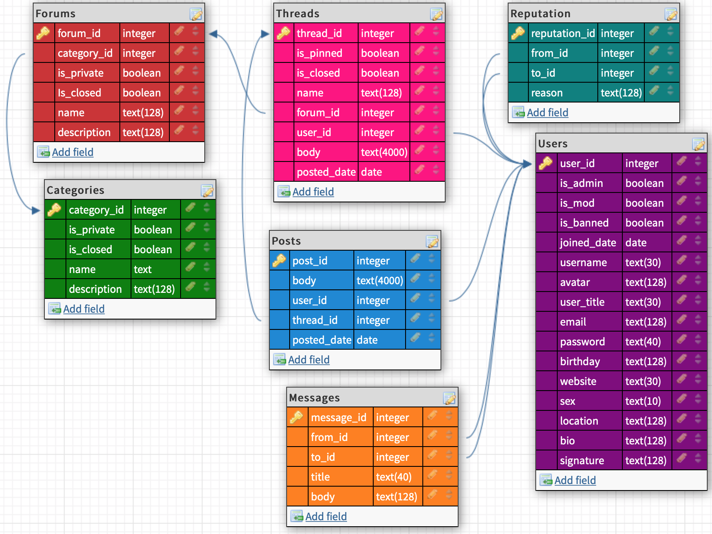

# forum by mosesin.tech (WIP)
This is going to be my jab at creating a full stack forum web app from scratch.
To be deployed on Heroku.

I decided to start with Create React App to give me a quick start to putting it together. I wanted to design the app before I started working on the logic. I find it too distracting to figure out logic if it's going to be displaying in an aesthetically unpleasing way. For this, I used SCSS. I realized from the start that I would need an advanced way of handling state, so I set up a Redux boilerplate after I designed the landing page.

After designing the pages you'll see below, I took a break to study database modeling, and to search for some extra tools to help me complete my project: http://DBdesigner.net and http://KanbanFlow.com. Then, I set up my back-end boilerplate and began working on the database and API.

## Progress

### List Displays:

### Thread Display:

### User Actions:

### Database:
