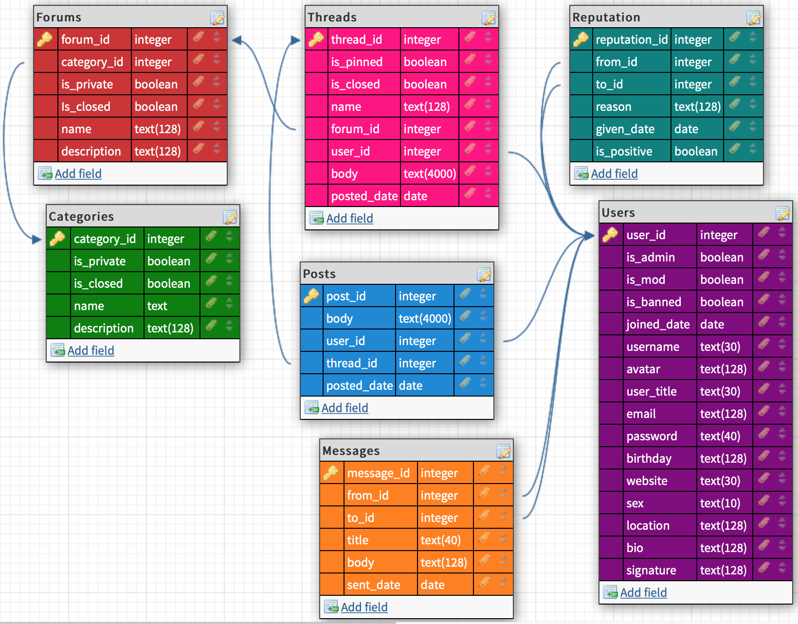

# About forum back end

## Endpoints

### Users

| Method | URL                         | Description                                                                                    |
| ------ | ----------------------------| ---------------------------------------------------------------------------------------------- |
| GET    | /api/users                  | Returns an array of all the users objects contained in the database.                           |
| GET    | /api/users/:id              | Returns the user object with the specified `id`.                                               |
| GET    | /api/users/:id/threads      | Returns an array of all the threads in the user object with the specified `id`.                |
| GET    | /api/users/:id/posts        | Returns an array of all the posts in the user object with the specified `id`.                  |
| GET    | /api/users/:id/messages/to  | Returns an array of all the messages in the user object with the specified `id` to the user.   |
| GET    | /api/users/:id/messages/from| Returns an array of all the messages in the user object with the specified `id` from the user. |
| GET    | /api/users/:id/reputation   | Returns an array of all the reputation in the user object with the specified `id`.             |
| PUT    | /api/users/:id              | Updates the user with the specified `id`. Returns the modified document.                       |
| DELETE | /api/users/:id              | Removes the user with the specified `id` and returns the deleted user.                         |

DELETE is exclusively an Administrator action.

### Categories

| Method | URL                        | Description                                                                        |
| ------ | -------------------------- | ---------------------------------------------------------------------------------- |
| POST   | /api/categories            | Creates a category.                                                                |
| GET    | /api/categories            | Returns an array of all the categories objects contained in the database.          |
| GET    | /api/categories/:id        | Returns the category object with the specified `id`.                               |
| GET    | /api/categories/:id/forums | Returns an array of all the forums in the category object with the specified `id`. |
| PUT    | /api/categories/:id        | Updates the category with the specified `id`. Returns the modified document.       |
| DELETE | /api/categories/:id        | Removes the category with the specified `id` and returns the deleted category.     |

POST, PUT, and DELETE are exclusively Administrator actions.

### Forums

| Method | URL                     | Description                                                                       |
| ------ | ----------------------- | --------------------------------------------------------------------------------- |
| POST   | /api/forums             | Creates a forum.                                                                  |
| GET    | /api/forums             | Returns an array of all the forums objects contained in the database.             |
| GET    | /api/forums/:id         | Returns the forum object with the specified `id`.                                 |
| GET    | /api/forums/:id/threads | Returns an array of all the threads in the forum object with the specified `id`.  |
| PUT    | /api/forums/:id         | Updates the forum with the specified `id`. Returns the modified document.         |
| DELETE | /api/forums/:id         | Removes the forum with the specified `id` and returns the deleted forum.          |

POST, PUT, and DELETE are exclusively Administrator actions.

### Threads

| Method | URL                    | Description                                                                     |
| ------ | ---------------------- | ------------------------------------------------------------------------------- |
| POST   | /api/threads           | Creates a thread.                                                               |
| GET    | /api/threads           | Returns an array of all the threads objects contained in the database.          |
| GET    | /api/threads/:id       | Returns the thread object with the specified `id`.                              |
| GET    | /api/threads/:id/posts | Returns an array of all the posts in the thread object with the specified `id`. |
| PUT    | /api/threads/:id       | Updates the thread with the specified `id`. Returns the modified document.      |
| DELETE | /api/threads/:id       | Removes the thread with the specified `id` and returns the deleted thread.      |

### Posts

| Method | URL            | Description                                                              |
| ------ | -------------- | ------------------------------------------------------------------------ |
| POST   | /api/posts     | Creates a post.                                                          |
| GET    | /api/posts     | Returns an array of all the posts objects contained in the database.     |
| GET    | /api/posts/:id | Returns the post object with the specified `id`.                         |
| PUT    | /api/posts/:id | Updates the post with the specified `id`. Returns the modified document. |
| DELETE | /api/posts/:id | Removes the post with the specified `id` and returns the deleted post.   |

### Messages

| Method | URL               | Description                                                                  |
| ------ | ----------------- | ---------------------------------------------------------------------------- |
| POST   | /api/messages     | Creates a message.                                                           |
| GET    | /api/messages     | Returns an array of all the message objects contained in the database.       |
| GET    | /api/messages/:id | Returns the message object with the specified `id`.                          |
| DELETE | /api/messages/:id | Removes the message with the specified `id` and returns the deleted message. |

### Reputation

| Method | URL                 | Description                                                                        |
| ------ | ------------------- | ---------------------------------------------------------------------------------- |
| POST   | /api/reputation     | Creates a reputation.                                                              |
| GET    | /api/reputation/:id | Returns the reputation object with the specified `id`.                             |
| DELETE | /api/reputation/:id | Removes the reputation with the specified `id` and returns the deleted reputation. |

DELETE is an Administrator and Moderator action.

### Authentication

| Method | URL                              | Description                        |
| ------ | -------------------------------- | ---------------------------------- |
| POST   | /api/authentication/register     | Creates a user.                    |
| POST   | /api/reputation/login            | Creates an authenticated session.  |
| GET    | /api/reputation/logout           | Destroys an authenticated session. |

## Database Model

## Database Schemas

### Users

| field      | data type        | metadata                                                                   |
| ---------- | ---------------- | -------------------------------------------------------------------------- |
| id         | unsigned integer | primary key, auto-increments, generated by database                        |
| is_admin   | boolean          | required, defaults to false                                                |
| is_mod     | boolean          | required, defaults to false                                                |
| is_banned  | boolean          | required, defaults to false                                                |
| joined_date| timestamp        | required, generated by database                                            |
| username   | text             | required, unique                                                           |
| avatar     | text             | required, defaults to 'https://avatarfiles.alphacoders.com/219/219973.jpg' |
| user_title | text             | required, defaults to 'New User'                                           |
| email      | text             | required, unique                                                           |
| password   | text             | required                                                                   |
| birthday   | date             | not required                                                               |
| website    | text             | not required                                                               |
| sex        | text             | not required                                                               |
| location   | text             | not required                                                               |
| bio        | text             | not required                                                               |
| signature  | text             | not required                                                               |

### Categories

| field      | data type        | metadata                                            |
| ---------- | ---------------- | --------------------------------------------------- |
| id         | unsigned integer | primary key, auto-increments, generated by database |
| is_private | boolean          | required, defaults to false                         |
| is_closed  | boolean          | required, defaults to false                         |
| name       | text             | required, unique                                    |
| description| text             | not required                                        |

### Forums

| field      | data type        | metadata                                            |
| ---------- | ---------------- | --------------------------------------------------- |
| id         | unsigned integer | primary key, auto-increments, generated by database |
| category_id| unsigned integer | foreign key                                         |
| is_private | boolean          | required, defaults to false                         |
| is_closed  | boolean          | required, defaults to false                         |
| name       | text             | required, unique                                    |
| description| text             | not required                                        |

### Threads

| field      | data type        | metadata                                            |
| ---------- | ---------------- | --------------------------------------------------- |
| id         | unsigned integer | primary key, auto-increments, generated by database |
| is_pinned  | boolean          | required, defaults to false                         |
| is_closed  | boolean          | required, defaults to false                         |
| name       | text             | required, unique                                    |
| forum_id   | unsigned integer | foreign key                                         |
| user_id    | unsigned integer | foreign key                                         |
| body       | text             | required                                            |
| posted_date| timestamp        | required, generated by database                     |

### Posts

| field      | data type        | metadata                                            |
| ---------- | ---------------- | --------------------------------------------------- |
| id         | unsigned integer | primary key, auto-increments, generated by database |
| body       | text             | required                                            |
| user_id    | unsigned integer | foreign key                                         |
| thread_id  | unsigned integer | foreign key                                         |
| posted_date| timestamp        | required, generated by database                     |

### Messages

| field      | data type        | metadata                                            |
| ---------- | ---------------- | --------------------------------------------------- |
| id         | unsigned integer | primary key, auto-increments, generated by database |
| from_id    | unsigned integer | foreign key                                         |
| to_id      | unsigned integer | foreign key                                         |
| title      | text             | required                                            |
| body       | text             | required                                            |
| sent_date  | timestamp        | required, generated by database                     |

### Reputation

| field      | data type        | metadata                                            |
| ---------- | ---------------- | --------------------------------------------------- |
| id         | unsigned integer | primary key, auto-increments, generated by database |
| from_id    | unsigned integer | foreign key                                         |
| to_id      | unsigned integer | foreign key                                         |
| is_positive| boolean          | required, defaults to true                          |
| reason     | text             | required                                            |
| given_date | timestamp        | required, generated by database                     |